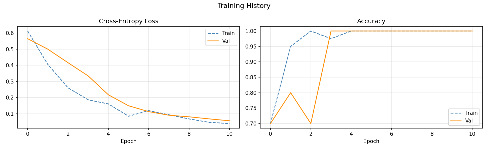

# 👤 Personal Face Authentication with ResNet18

A deep learning project for personal face authentication using transfer learning with a pretrained ResNet18 model.

The system performs binary classification on face images and predicts whether the uploaded face belongs to:

```text
YOU
NOT YOU
```

The project includes model training, evaluation, transfer learning, data augmentation, and deployment through an interactive Gradio web application.

## 📌 About the Project

The goal of this project is to build a personal face authentication system using a small custom face dataset.

Instead of training a convolutional neural network from scratch, the project uses a pretrained **ResNet18** model and applies transfer learning.

The pretrained backbone is frozen, while the final classification layer is replaced and trained for two output classes.

## 🧠 Model Architecture

The project uses:

```text
ResNet18
```

pretrained on ImageNet.

The original ResNet18 classification layer is replaced with a new fully connected layer:

```text
512 features → 2 classes
```

The classes are:

```text
0 → NOT YOU
1 → YOU
```

Only the final classification layer is trainable, while the pretrained backbone remains frozen.

## 🔄 Transfer Learning

Transfer learning is used to reuse visual features learned from ImageNet.

The workflow is:

```text
Pretrained ResNet18
        ↓
Freeze convolutional backbone
        ↓
Replace final classification layer
        ↓
Train new binary classification head
        ↓
YOU / NOT YOU prediction
```

This allows the model to work effectively with a relatively small personal dataset.

## 📚 Dataset

The dataset is divided into two classes:

### Positive Class

Personal face images representing:

```text
YOU
```

The positive dataset contains:

```text
20 training images
5 validation images
5 test images
```

### Negative Class

The negative class represents:

```text
NOT YOU
```

The negative samples are automatically downloaded from the Labeled Faces in the Wild (LFW) dataset.

The project uses fixed negative identities to create balanced train, validation, and test splits.

## 🔐 Data Privacy

Personal face images are intentionally **not included in this repository**.

The following directory is excluded from version control:

```text
data/
```

Users who want to run the project must provide their own positive face images.

## 🖼️ Image Preprocessing

Images are resized to:

```text
224 × 224
```

and normalized using ImageNet statistics.

Training images also use data augmentation including:

- Random cropping
- Horizontal flipping
- Brightness adjustment
- Contrast adjustment

These transformations help improve generalization.

## ⚙️ Training Configuration

Default configuration:

```text
Batch Size:       16
Epochs:           20
Learning Rate:    0.001
Random Seed:      42
Early Stopping:   7 epochs
Backbone:         ResNet18
Pretrained:       Yes
Number of Classes: 2
Image Size:       224 × 224
```

## 🚀 Training

The training pipeline uses:

- Cross-Entropy Loss
- Adam Optimizer
- Transfer Learning
- Validation monitoring
- Early stopping
- Model checkpointing

The best-performing model is automatically saved based on validation accuracy.

## 📈 Training History

The project tracks:

- Training loss
- Validation loss
- Training accuracy
- Validation accuracy

Example training curves:



The training history can be used to analyze convergence and potential overfitting.

## 📊 Evaluation

The model is evaluated using binary classification metrics:

- Accuracy
- Precision
- Recall
- F1 Score

The positive class is treated as:

```text
YOU
```

The evaluation also reports prediction probabilities for:

```text
P(YOU)
P(NOT YOU)
```

## 🔍 Prediction

For a single input image, the model produces probabilities similar to:

```text
YOU:      0.94
NOT YOU:  0.06
```

The class with the higher probability is selected as the prediction.

## 🌐 Gradio Web Application

The trained model can be used through an interactive Gradio interface.

Users can upload a face image and receive a prediction:

```text
YOU
or
NOT YOU
```

The interface displays probabilities for both classes.

## 🛠 Technologies & Libraries

- Python
- PyTorch
- Torchvision
- ResNet18
- Transfer Learning
- Convolutional Neural Networks
- NumPy
- Pillow
- Scikit-learn
- Matplotlib
- Gradio
- Jupyter Notebook

## 🧩 Key Concepts

This project demonstrates:

- Deep Learning
- Computer Vision
- Face Authentication
- Binary Image Classification
- Convolutional Neural Networks
- Transfer Learning
- ResNet18
- Feature Reuse
- Model Fine-Tuning
- Data Augmentation
- Train / Validation / Test Splitting
- Early Stopping
- Precision
- Recall
- F1 Score
- Model Deployment
- Gradio

## 📂 Project Structure

```text
personal-face-authentication-resnet18/
│
├── src/
│   ├── dataset.py
│   ├── model.py
│   ├── train.py
│   ├── evaluate.py
│   └── app.py
│
├── results/
│   └── training_curves.png
│
├── notebook.ipynb
├── config.json
├── requirements.txt
├── README.md
└── .gitignore
```

Generated files and personal images are excluded:

```text
data/
checkpoints/
logs/
*.pt
*.npy
```

## 📄 File Overview

### `model.py`

Builds the transfer-learning model by:

- Loading pretrained ResNet18
- Freezing the backbone
- Replacing the final fully connected layer
- Configuring two-class classification

### `train.py`

Implements the model training pipeline including:

- Forward pass
- Loss calculation
- Backpropagation
- Optimizer updates
- Validation
- Early stopping
- Best-model checkpointing

### `evaluate.py`

Calculates:

- Accuracy
- Precision
- Recall
- F1 Score

### `app.py`

Implements:

- Single-image inference
- Softmax probabilities
- YOU / NOT YOU predictions
- Gradio web interface

### `dataset.py`

Handles:

- Image loading
- Dataset splitting
- Image preprocessing
- Data augmentation
- DataLoader creation
- Negative-class image preparation

### `notebook.ipynb`

Provides the main workflow for:

```text
Dataset
→ Model
→ Training
→ Evaluation
→ Gradio Application
```

## 📦 Installation

Clone the repository:

```bash
git clone https://github.com/YOUR_USERNAME/personal-face-authentication-resnet18.git
cd personal-face-authentication-resnet18
```

Install dependencies:

```bash
pip install -r requirements.txt
```

## 📁 Prepare Your Images

Create:

```text
data/
└── positive/
    ├── train/
    ├── val/
    └── test/
```

Add your own face images:

```text
train → 20 images
val   → 5 images
test  → 5 images
```

Do not reuse test images in the training or validation sets.

## ▶️ Training

Run:

```bash
python src/train.py --config config.json
```

## 🌐 Run the Web App

After training and generating a checkpoint:

```bash
python src/app.py
```

Then open the Gradio interface and upload a face image.

## ⚠️ Notes

- Personal face images are not included in this repository.
- Trained checkpoints are excluded to keep the repository lightweight.
- A trained model must be generated locally before running the Gradio application.

## 🎓 Course Project

Developed as part of:

**CNG403**

Middle East Technical University, Northern Cyprus Campus.

## 👤 Author

Fatih Sağlam